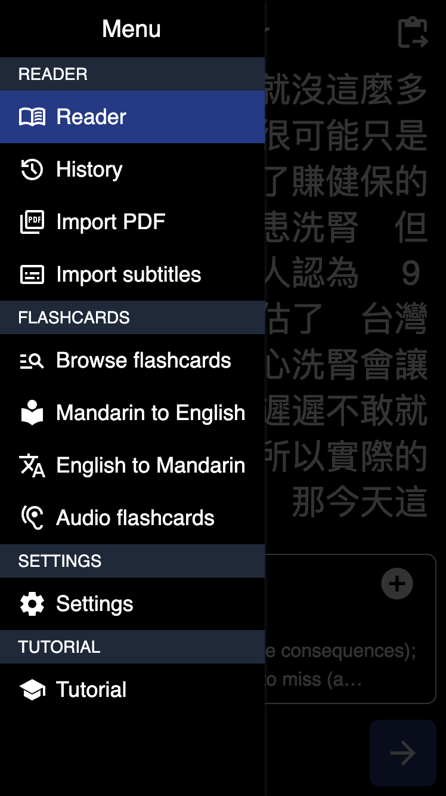
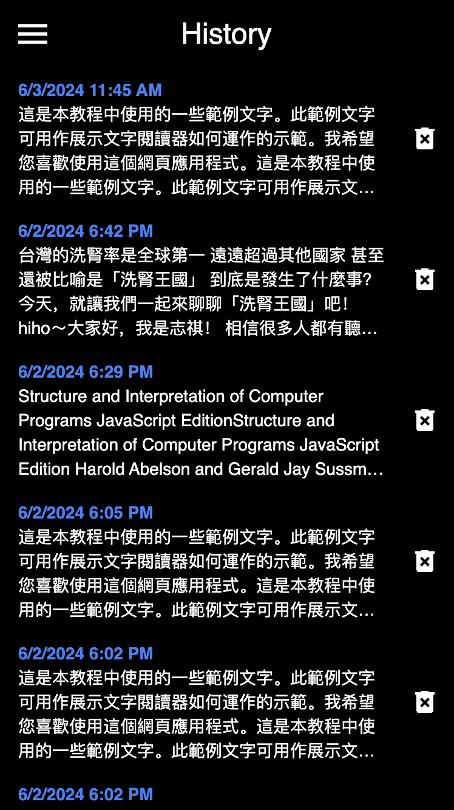
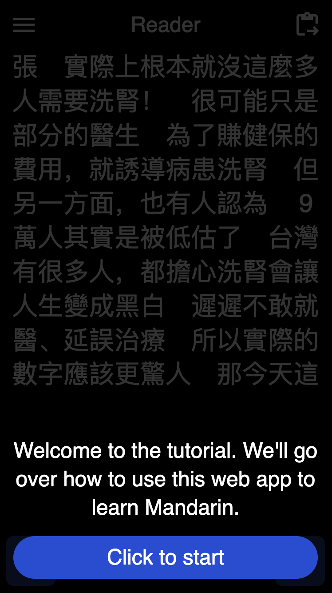

# Mandarin Reader

A Mandarin Chinese PDF, subtitle, and clipboard text reader with a popup dictionary and built-in spaced-repetition flashcards. Installable as a progressive web app on mobile and desktop (Android, iOS, Windows, Mac OS, and Linux) and works entirely offline. Written with [React](https://react.dev), [TypeScript](https://www.typescriptlang.org), [Next.js](https://nextjs.org), [TailwindCSS](https://tailwindcss.com), and [Zustand](https://github.com/pmndrs/zustand). Inspired by [Pleco](https://www.pleco.com). Initialized with [create-react-app](https://create.t3.gg).

## Features

- Import Mandarin PDFs, subtitle files, and paste clipboard text to convert them to readable text
- Look up Mandarin words you don't know by clicking on them in the reader
- Save words as flashcards by clicking on the "+" button
- Learn words in context by having the word's context automatically saved to each flashcard
- Flashcards use a spaced-repetition algorithm to maximize learning efficiency
- Works entirely offline
- Installable on mobile and desktop as a progressive web app (works on Android, iOS, Windows, Mac OS, and Linux)

## Screenshots

  
  
  
  
  
  
  
  
  
  
  
  

## Credits

- [Pleco](https://www.pleco.com) for design inspiration
- [CC-CEDICT](https://www.mdbg.net/chinese/dictionary?page=cedict) for the Mandarin Chinese dictionary text file
